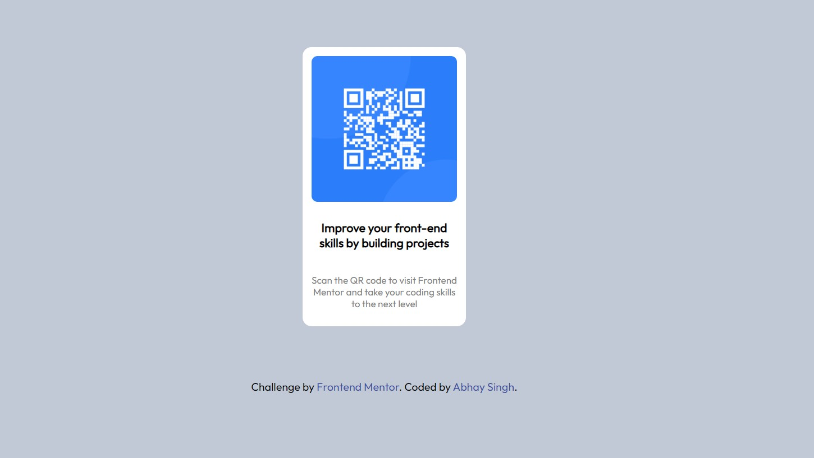

# Frontend Mentor - QR code component solution

This is a solution to the [QR code component challenge on Frontend Mentor](https://www.frontendmentor.io/challenges/qr-code-component-iux_sIO_H). Frontend Mentor challenges help you improve your coding skills by building realistic projects.

## Table of contents

- [Overview](#overview)
  - [Screenshot](#screenshot)
  - [Links](#links)
- [My process](#my-process)
  - [Built with](#built-with)
  - [What I learned](#what-i-learned)
  - [Continued development](#continued-development)
  - [Useful resources](#useful-resources)
- [Author](#author)


## Overview

### Screenshot




### Links

- Solution URL: [Add solution URL here](https://your-solution-url.com)
- Live Site URL: [Add live site URL here](https://your-live-site-url.com)

## My process

### Built with

- Semantic HTML5 markup
- Div box model
- CSS custom properties


### What I learned

During this project I learned the use of different CSS selectors. Also while building this project, I came to know how we can make font sizes responsive, using vw, vh, vmin, and vmax.

Below, I have mentioned about how I used vmin for making text responsive.

```css
.qr-code-container{
  width: 29vmin;
}
```


### Continued development

I learned a bit about making text responsive. But there is a lot I need to look about making the whole document responsive, be its layout, text, or anything such.
Also, I use to get stuck when positioning and arranging the elements properly, which I am plannig to explore more.


### Useful resources

- Whenever I need any help, I definetly check these resources mentioned below:
- [Example resource 1](https://www.w3schools.com/)
- [Example resource 2](https://developer.mozilla.org/)


## Author

- My Simple Website - [Abhay Singh](https://amrit066.github.io/Simple-Portfolio/)
- Frontend Mentor - [@Amrit066](https://www.frontendmentor.io/profile/Amrit066)
